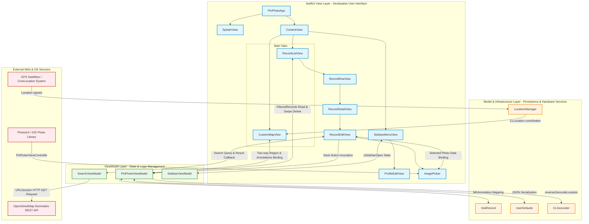
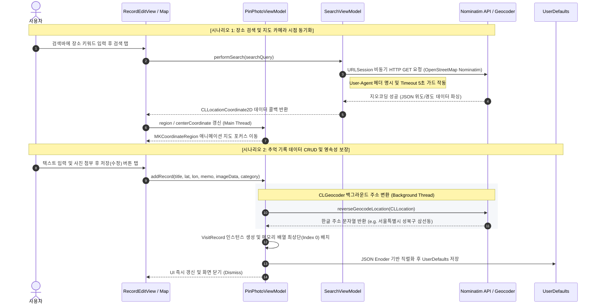

# PinPhoto (일상의 기록을 지도로 남기다)

'**PinPhoto**'는 사용자의 소중한 일상과 여행의 기억을 위치 데이터와 함께 체계적으로 기록하고 관리하는 iOS 기반의 **지도 중심 메모 애플리케이션**입니다. MVVM 패턴을 충실히 따르며, 선언형 UI(SwiftUI)와 명령형 맵뷰(MapKit/UIKit)를 유기적으로 결합하여 높은 UX 완성도와 데이터 정합성을 제공합니다.

---

## 🎥 시연 영상
[[PinPhoto 시연 영상](https://www.youtube.com/watch?v=jDVJ7gjTEgM)]

---

## 🏗️ 시스템 아키텍처 및 데이터 흐름 (System Architecture & Data Flow)

PinPhoto는 **MVVM (Model-View-ViewModel)** 디자인 패턴을 채택하여 선언형 뷰 레이어와 비즈니스 로직, 데이터 영속성 레이어를 명확히 분리했으며, 역할 및 의존성에 따라 다음과 같이 설계되었습니다.

### 1. 컴포넌트 레이어 및 의존성 아키텍처 (Component Layer & Dependency Map)
앱 내의 모든 뷰, 뷰모델, 서비스 모듈 및 외부 API가 어떤 계층에 속해 있고 어떤 흐름으로 의존성을 맺고 있는지 보여주는 구조도입니다.



* **UI 레이어 (View Layer)**: `SwiftUI` 뷰들은 선언적으로 구성되어 있으며, `CustomMapView`와 `ImagePicker`처럼 UIKit 구성 요소가 필요할 때만 `UIViewRepresentable` 및 `UIViewControllerRepresentable` 인터페이스를 통해 래핑 결합됩니다.
* **비즈니스 로직 레이어 (ViewModel Layer)**: 상태관리를 위해 `ObservableObject` 프로토콜을 구현하였으며, 뷰가 직접 데이터베이스나 외부 API에 접근하는 것을 완벽히 격리시켰습니다.
* **영속성 및 외부 연동 레이어**: 하드웨어 GPS 장치 및 iOS 기기 내 포토 앨범 권한 처리와 로컬 영속성 스토어(`UserDefaults`)를 추상화하여 안전하게 관리합니다.

---

### 2. 핵심 비즈니스 프로세스 시퀀스 (Runtime Core Flow Sequence)
동작 시 스레드 분기(Background & Main Thread)와 비동기 콜백 처리가 어떻게 일어나는지 구체적으로 묘사한 흐름도입니다.



* **비동기 REST API 호출**: 장소 검색 시 `SearchViewModel`이 백그라운드 데이터 세션(`URLSession.shared.dataTask`)으로 Nominatim API를 호출하고, 파싱이 완료되면 결과를 메인 스레드(`DispatchQueue.main.async`)로 다시 디스패치해 UI 반응성을 극대화했습니다.
* **백그라운드 지오코딩**: 기록을 저장할 때 경위도 좌표를 한글 주소로 치환하는 `CLGeocoder.reverseGeocodeLocation`은 내부적으로 Apple의 백그라운드 위치 서비스 데몬과 비동기식 스레드로 동작하므로, 앱의 화면이 얼어붙는 현상(ANR)을 예방합니다.

---

## 🚀 핵심 기능 상세 기술 분석 

### 📍 1. Map & Location Intelligence

#### A. UIViewRepresentable과 Coordinator 기반의 MKMapView 양방향 데이터 바인딩
SwiftUI 환경에서 UIKit 기반의 강력한 `MKMapView`를 사용하기 위해 `UIViewRepresentable` 프로토콜과 `Coordinator` 패턴을 적용했습니다. 지도의 움직임(드래그, 확대/축소)에 따라 발생하는 이벤트를 SwiftUI 뷰 상태와 동기화하기 위해 `MKMapViewDelegate` 내 `regionDidChangeAnimated`를 오버라이드하여 데이터 무결성을 보장합니다.

```swift
// CustomMapView.swift 중 일부
func mapView(_ mapView: MKMapView, regionDidChangeAnimated animated: Bool) {
    // 지도 뷰포트 드래그 시 뷰모델의 centerCoordinate를 실시간 업데이트하여 일치화
    DispatchQueue.main.async {
        self.parent.centerCoordinate = mapView.centerCoordinate
    }
}
```

#### B. 메모리 및 렌더링 효율을 극대화한 MKAnnotationView 재사용 패턴
지도가 이동할 때 수많은 사진 핀이 동시 생성되면 메모리 사용량이 급증하고 렌더링 프레임 드랍(Stuttering)이 발생할 수 있습니다. 이를 방지하기 위해 UIKit의 **재사용 메커니즘(`dequeueReusableAnnotationView`)**을 구현하여 자원을 재활용합니다.
* 커스텀 핀 내부에는 방문 레코드의 이미지 썸네일을 둥근 서클 형태로 배치하고, 테두리에 메인 컬러 보더라인과 그림자(Shadow) 효과를 주어 세련된 입체감을 연출했습니다.
* 저장된 이미지가 없는 디폴트 상태에서는 SF Symbol인 `mappin.circle.fill`을 렌더링하도록 예외 처리 가드를 적용했습니다.

#### C. MKPolyline을 이용한 시간순 방문 동선(Footsteps) 실시간 렌더링
`VisitRecord`에 기록된 타임스탬프(`Date`)를 기준으로 배열을 오름차순 정렬하여 지도 상에 순차적 라인 경로(`MKPolyline`)를 생성 및 렌더링합니다. 
* 뷰 업데이트 시 기존 렌더링 오버레이를 해제하고 정렬된 좌표 리스트를 새로 매핑함으로써 메모리 누수 없이 실시간으로 궤적을 갱신합니다.

---

### 🌐 2. Nominatim Geocoding Engine (네트워크 우회 설계)

가상 머신(VM) 및 로컬 시뮬레이터 환경에서 MapKit 프레임워크의 자체 `MKLocalSearch`가 정상적으로 동작하지 않거나 네트워크 정책에 의해 내부 가드가 발생하는 특수한 한계를 극복하기 위해, **오픈소스 장소 정보 엔진인 OpenStreetMap Nominatim API**를 활용한 커스텀 검색 파이프라인을 구축했습니다.

```swift
// SearchViewModel.swift 중 일부
func performSearch(currentRegion: MKCoordinateRegion, completion: @escaping(CLLocationCoordinate2D?) -> Void) {
    let trimmedQuery = searchQuery.trimmingCharacters(in: .whitespacesAndNewlines)
    guard !trimmedQuery.isEmpty else { return }
    
    // URL Query 인코딩 가드 및 엔드포인트 URL 생성
    guard let encodedQuery = trimmedQuery.addingPercentEncoding(withAllowedCharacters: .urlQueryAllowed),
          let url = URL(string: "https://nominatim.openstreetmap.org/search?q=\(encodedQuery)&format=json&limit=1&addressdetails=1") else {
        completion(nil)
        return
    }
    
    var request = URLRequest(url: url)
    // Nominatim API Usage Policy 준수를 위해 명확한 User-Agent 헤더 명시
    request.setValue("PinPhotoApp/1.0 (suna_bae@hansung.ac.kr)", forHTTPHeaderField: "User-Agent")
    request.timeoutInterval = 5.0 // 타임아웃 5초 설정으로 반응성 확보
    
    URLSession.shared.dataTask(with: request) { data, response, error in
        if let error = error {
            print(" [웹 API 우회 실패]: \(error.localizedDescription)")
            completion(nil)
            return
        }
        
        guard let data = data else { completion(nil); return }
        
        do {
            if let jsonArray = try JSONSerialization.jsonObject(with: data, options: []) as? [[String: Any]],
               let firstResult = jsonArray.first,
               let latStr = firstResult["lat"] as? String,
               let lonStr = firstResult["lon"] as? String,
               let latitude = Double(latStr),
               let longitude = Double(lonStr) {
                
                let coordinate = CLLocationCoordinate2D(latitude: latitude, longitude: longitude)
                
                DispatchQueue.main.async {
                    completion(coordinate)
                }
            } else {
                completion(nil)
            }
        } catch {
            completion(nil)
        }
    }.resume()
}
```
* **핵심 결정**: API 정책(Usage Policy)을 엄격히 준수하기 위해 고유한 `User-Agent` 문자열을 커스텀 HTTP 헤더에 실어 호출하며, `timeoutInterval`을 5.0초로 제한하여 열악한 네트워크 환경 하에서도 사용자 UI 스레드가 블로킹(ANR)되지 않도록 비동기 설계했습니다.

---

### 📝 3. Record Management System & Data Consistency

#### A. Codable 기반 JSON 직렬화 & UserDefaults 로컬 영속성 레이어
대규모 상용 앱으로 가기 전의 경량성 및 이식성을 보장하기 위해 `VisitRecord`를 `Codable` 프로토콜로 설계하고, JSON 형식으로 인코딩/디코딩하여 `UserDefaults` 내에 영구 저장하는 방식으로 구현했습니다.
* 앱이 구동될 때 백그라운드 리드 후 메인 스레드 통보(`DispatchQueue.main.async`) 흐름을 유지하여 대용량 이미지 이진 데이터(Binary Data) 디코딩 시 유발되는 메인 런루프의 정체를 성공적으로 차단했습니다.

#### B. 데이터 정합성 보장을 위한 CRUD 트랜잭션 (Delete-Insert 기법)
기존 저장 기록의 세부 내용(사진, 텍스트, 카테고리 등) 수정 시, 식별자 충돌 및 로컬 DB 무결성 훼손을 방지하고 코드의 복잡성을 단순화하기 위해 **"기존 데이터 삭제 ➡️ 신규 데이터 삽입"** 트랜잭션 플로우를 구현했습니다.

```swift
// RecordEditView.swift 중 일부
private func saveAction() {
    let targetLatitude = currentCoordinate?.latitude ?? viewModel.region.center.latitude
    let targetLongitude = currentCoordinate?.longitude ?? viewModel.region.center.longitude
    
    // 데이터 정합성 보장: 기존 레코드가 존재할 경우 식별자 매칭 후 완전 제거
    if let existingRecord = record {
        if let originalIndex = viewModel.records.firstIndex(where: { $0.id == existingRecord.id }) {
            viewModel.deleteRecord(at: originalIndex)
        }
    }
    
    // 신규 레코드로 새롭게 생성하여 배열의 최상단(Index 0)에 삽입
    viewModel.addRecord(
        title: titleText.isEmpty ? "제목 없음" : titleText,
        latitude: targetLatitude,
        longitude: targetLongitude,
        memo: memoText.isEmpty ? "추가된 메모가 없습니다." : memoText,
        imageData: selectedImageData,
        category: selectedCategory
    )
    presentationMode.wrappedValue.dismiss()
}
```
* **UX 향후 효과**: 수정된 기록이 시간 및 업데이트 가중치에 맞춰 사용자 인터페이스 상 리스트의 최상위(최신 항목)로 즉시 오도록 제어하여, 동적 체감 속도를 높였습니다.

#### C. Case-Insensitive 키워드 검색 엔진
SwiftUI의 Computed Property(`filteredRecords`)를 활용해 카테고리 필터와 다차원 텍스트 키워드 필터링을 결합했습니다. 대소문자 구분을 없앤 `localizedCaseInsensitiveContains` 연산 파이프라인을 구축하여 고속 문자열 대조 알고리즘을 수행합니다.

---

### 📊 4. Statistical Dashboard & Ranking Algorithm

사용자의 데이터 기반 카테고리 선호도 분석 리포트를 대시보드 화면을 통해 제공합니다. 방문 이력을 계측할 때, 방문 빈도가 정확히 동일한 동점 카테고리가 발생하는 특수한 상황에서 일관되지 않은 랭킹 표시 오류(Undetermined State)를 방지하기 위해 **2차 비교 인자를 적용한 결정론적(Deterministic) 정렬 알고리즘**을 개발했습니다.

```swift
// DashboardView.swift 중 일부
var topCategories: [(key: MemoryCategory, value: Int)] {
    // 1단계: 기록 배열을 카테고리별 그룹화
    let grouped = Dictionary(grouping: viewModel.records) { $0.category }
    
    // 2단계: 그룹의 원소 개수(방문 수) 집계 및 안정 정렬(Stable Sort) 수행
    let sorted = grouped.mapValues { $0.count }.sorted { (a, b) -> Bool in
        if a.value != b.value {
            return a.value > b.value       // 1차 기준: 방문 횟수가 많은 순 (내림차순)
        } else {
            return a.key.rawValue < b.key.rawValue // 2차 기준: 방문 횟수가 같으면 가나다순 정렬 (사전순)
        }
    }
    return Array(sorted.prefix(3)) // 상위 3개 카테고리 반환
}
```
* **장점**: 단순히 방문 횟수만 비교할 경우 발생할 수 있는 배열 정렬 순서의 흔들림을 막고, 사용자에게 항상 일관되고 고정된 데이터(가나다 사전순)를 반환하도록 고안된 알고리즘 설계입니다.

---

## 📂 프로젝트 폴더 구조 (Project Directory Structure)

```text
PinPhoto
├── PinPhoto.xcodeproj         # Xcode 프로젝트 설정 파일
└── PinPhoto                   # 메인 소스 코드 디렉토리
    ├── PinPhotoApp.swift      # 앱 진입점 (App Entrypoint)
    ├── Info.plist             # 앱 설정 및 권한 사양 파일
    ├── Assets.xcassets        # 이미지, 에셋 리소스 및 컬러 에셋
    │
    ├── Models
    │   └── VisitRecord.swift  # 데이터 모델 객체 및 Category Enum 선언 (MKAnnotation 구현)
    │
    ├── ViewModels
    │   ├── PinPhotoViewModel.swift  # 핵심 CRUD 및 로컬 DB 영속 제어 뷰모델
    │   ├── SearchViewModel.swift    # Nominatim API 기반 위치 검색 제어 뷰모델
    │   └── SidebarViewModel.swift   # 반응형 사이드바 상태 제어 뷰모델
    │
    └── Views
        ├── ContentView.swift        # 메인 탭 네비게이션 및 사이드바 통합 뷰
        ├── CustomMapView.swift      # MapKit 기반 커스텀 지도 렌더링 뷰 (UIViewRepresentable)
        ├── DashboardView.swift      # 통계 리포트 및 카테고리 랭킹 대시보드 뷰
        ├── RecordListView.swift     # 기록 목록 및 실시간 필터/검색 엔진 장착 뷰
        ├── RecordRowView.swift      # 리스트에 렌더링될 개별 레코드 UI 뷰
        ├── RecordDetailView.swift   # 작성된 레코드 상세 뷰
        ├── RecordEditView.swift     # 레코드 생성/수정/삭제 조작 뷰 (미니맵 및 주소 포함)
        ├── SidebarMenuView.swift    # 유저 프로필 및 네비게이션을 담은 슬라이딩 사이드바 뷰
        ├── ProfileEditView.swift    # 사용자 정보(사진/닉네임) 커스터마이징 뷰
        ├── SplashView.swift         # 앱 실행 시 기동하는 로딩 스플래시 화면 뷰
        └── ImagePicker.swift        # 시스템 포토 앨범 연동 뷰 (UIViewControllerRepresentable)
```

---

## 🛠 기술 스택 (Tech Stack)

| 구분 | 상세 기술 사양 |
| :--- | :--- |
| **개발 언어** | Swift 5.9+ |
| **UI 프레임워크** | SwiftUI (iOS 15.0+ 타겟) |
| **지도 및 위치 서비스** | MapKit, CoreLocation |
| **네트워크 통신** | URLSession (REST API, 비동기 파이프라인) |
| **아키텍처 패턴** | MVVM (Model - View - ViewModel) |
| **데이터 영속성** | JSON Serialization, UserDefaults |
| **디바이스 기능 연동** | PhotosUI, PHPickerViewController |

---

## 📈 Git 브랜치 전략 (Git Flow)

안정적인 릴리즈 관리와 효율적인 병렬 개발을 수행하기 위해 표준 Git-Flow에 입각한 브랜칭 규칙을 운용했습니다.

* **`main`**: 상용 릴리즈 배포 브랜치 (출시용 빌드 산출)
* **`develop`**: 개발 메인 통합 브랜치 (기능이 병합되고 통합 테스트 진행)
* **`feature/*`**: 작업 단위별 독립 개발 브랜치
  * `feature/1-map`: MapKit 커스텀 핀 구현 및 CoreLocation 권한 바인딩
  * `feature/2-location-search`: Nominatim API 기반의 비동기 지오코딩 장소 검색 구현
  * `feature/3-record-crud-ops`: 기록 쓰기, 상세 보기, UserDefaults 직렬화 및 정합성 보장 구현
  * `feature/4-list-filter-engine`: Case-Insensitive 검색 및 카테고리 칩 필터링 구현
  * `feature/5-sidebar-profile`: 사이드 바 레이아웃 및 앨범 연동 프로필 수정 구현
  * `feature/6-dashboard-analytics`: 다차원 랭킹 정렬 알고리즘 기반 대시보드 구현
  * `feature/7-polishing-ux`: 스플래시 화면, 애니메이션 최적화 및 안정화

---

## 🔜 향후 고도화 계획 (Roadmap)

1. **로컬 데이터베이스 현대화**:
   * 대규모 바이너리(고용량 사진)의 성능 병목을 극복하고 다대다 관계형 매핑을 위해, 기존 `UserDefaults` 기반 직렬화에서 최신 **CoreData** 또는 **SwiftData**로 영속성 프레임워크를 마이그레이션할 계획입니다.
2. **네비게이션 라우팅 흐름 캡슐화**:
   * View 내부의 SwiftUI `.sheet` 및 `NavigationLink` 종속성을 분리하기 위해, **Coordinator 패턴(Flow Coordinator)**을 뷰모델 레이어에 탑재하여 라우팅 제어 책임을 완전히 캡슐화할 예정입니다.
3. **Reactive 프로그래밍 결합 극대화**:
   * `Combine` 프레임워크를 적극 도입하여, 사용자 검색어 입력창(`TextField`)에 대한 디바운스(Debounce), 스로틀(Throttle) 처리를 통해 불필요한 Nominatim HTTP API 중복 트래픽을 차단하고 쿼리 요청 효율을 대폭 끌어올릴 예정입니다.
